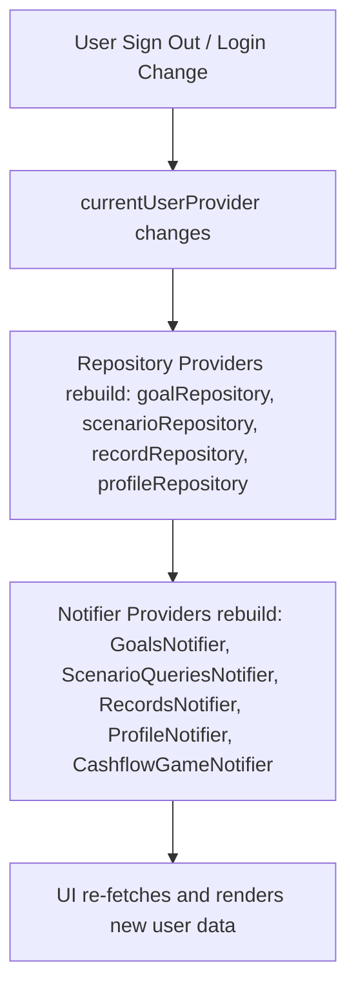

# Specification: Auth & Data Isolation Fixes

## 1. Executive Summary
This document specifies the logic improvements for user data isolation upon account switching and local guest data deletion on account deletion. 

---

## 2. User Stories
- **As a regular user,** when I sign out of Account A and sign in to Account B, I expect all dashboard screens, goals, timelines, and cashflow games to reload instantly with Account B's data so that Account A's data is never leaked or visible.
- **As a guest user,** when I log out, my data should be retained locally. However, when I choose to "Delete Account", my local data must be wiped completely to protect my privacy.

---

## 3. Database Design
This change does not modify the database schema. It utilizes the existing Supabase structures for online users and SharedPreferences keys for Guest:
- `local_goals`
- `local_scenarios`
- `local_records`
- `local_financial_profile`
- `onboarding_completed`
- `local_username`
- `logged_in_user`

---

## 4. Logic Flowchart (Mermaid)

---

## 5. API Contract
No new API endpoints. This change leverages the current Supabase Client APIs and local storage wrappers.

---

## 6. UI Components
No new UI components. Existing components watching Riverpod providers will automatically react and rebuild when the state changes.

---

## 7. Scheduled Tasks
None.

---

## 8. Third-party Integrations
None.

---

## 9. Hidden Requirements
- Avoid calling `SharedPreferences.clear()` for guest account deletion as it would wipe global application states (e.g. settings, themes). Only clear guest-specific keys.

---

## 10. Tech Stack
- Riverpod (State Management)
- Supabase (Backend/Auth)
- SharedPreferences (Local Storage)

---

## 11. Build Checklist
- [ ] Implement provider rebuild triggers (watch repository providers inside build).
- [ ] Add guest account deletion logic in `AuthRepositoryImpl.deleteAccount()`.
- [ ] Test switching between local guest and regular online user profiles.
