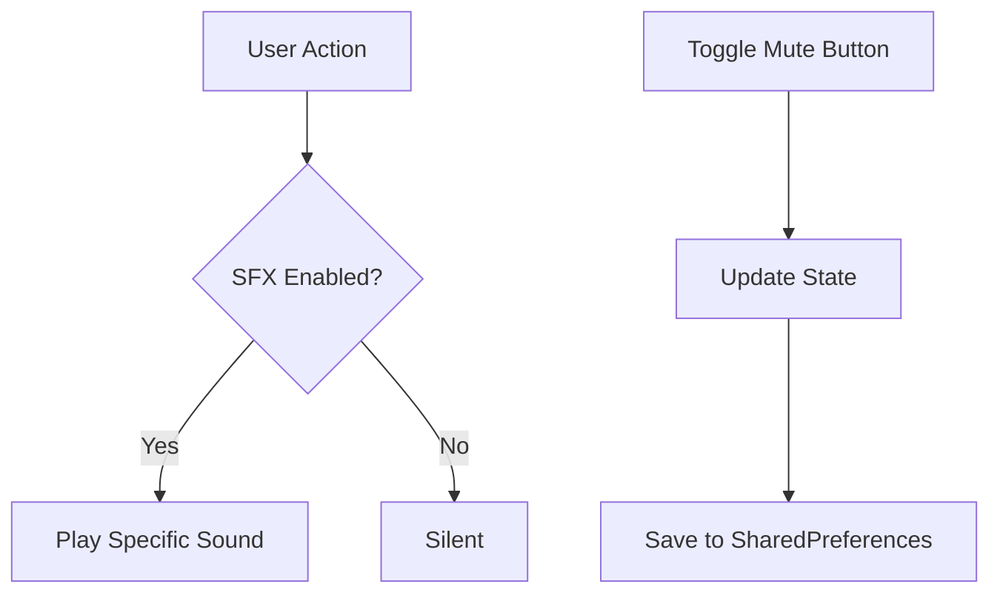

# Spec: Cashflow Game Sound Effects (SFX)

## 1. Executive Summary
Thêm hiệu ứng âm thanh (SFX) cho các tương tác chính trong trò chơi Cashflow để tăng tính tương tác, và cung cấp cài đặt bật/tắt âm thanh được lưu trữ vĩnh viễn.

## 2. User Stories
- Là người chơi, tôi muốn nghe tiếng xúc xắc khi đổ để có cảm giác chân thực.
- Là người chơi, tôi muốn nghe tiếng "Ka-ching!" khi nhận lương để có cảm giác tưởng thưởng.
- Là người chơi, tôi muốn nghe tiếng lật bài khi bốc thẻ để biết hành động đã diễn ra.
- Là người chơi, tôi muốn nghe tiếng "Click" hoặc "Ting" khi mua tài sản/trả nợ thành công.
- Là người chơi, tôi muốn có thể bật/tắt âm thanh dễ dàng và hệ thống nhớ cài đặt này cho lần chơi sau.

## 3. Logic Flowchart

## 4. API Contract & Tech Stack
- **Tech Stack:** Flutter, `audioplayers`, `shared_preferences`, Riverpod.
- **Assets:** Cần chuẩn bị 4 file âm thanh: `dice_roll.mp3`, `payday.mp3`, `card_flip.mp3`, `success.mp3`.

## 5. UI Components
- **Mute/Unmute Button:** Đặt ở góc trên màn hình (AppBar hoặc HUD của Game Board). Sử dụng Icon `volume_up` và `volume_off`.
