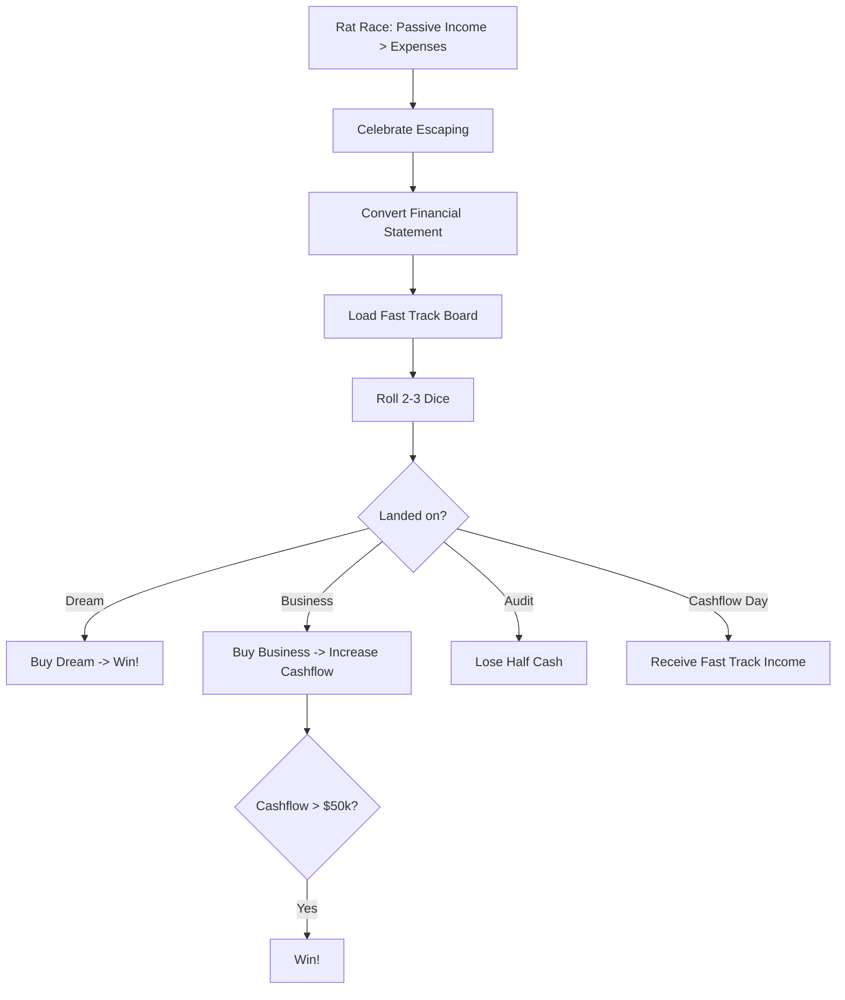

# Spec: Fast Track (Cashflow Game)

## 1. Executive Summary
Vòng Fast Track dành cho người chơi đã thoát khỏi Rat Race. Ở vòng này, người chơi có bàn cờ mới, thu nhập khổng lồ, và mục tiêu là mua được Ước mơ (Dream) hoặc tăng thu nhập thụ động thêm $50,000.

## 2. User Stories
- Là người chơi, khi Passive Income > Expenses, tôi muốn có màn hình chúc mừng và được chuyển sang bàn cờ Fast Track.
- Là người chơi, tôi muốn thấy bàn cờ Fast Track với các ô mới (Business, Dream, Audit, Charity).
- Là người chơi, tôi muốn mua các doanh nghiệp lớn để tăng $50,000 Cashflow Day.
- Là người chơi, tôi muốn chiến thắng game khi quay vào ô Ước mơ của mình và đủ tiền mua nó.

## 3. Logic Flowchart

## 4. API Contract & Tech Stack
- Frontend: Flutter, Riverpod (cho GameState).
- Models: Thêm `isFastTrack` boolean vào `GameState`, thêm mảng `fastTrackBusinesses`.

## 5. UI Components
- `FastTrackBoardPage`: Bàn cờ mới với thiết kế và màu sắc sang trọng.
- Dialogs: `BuyBusinessDialog`, `DreamDialog`, `AuditDialog`, `WinGameDialog`.
